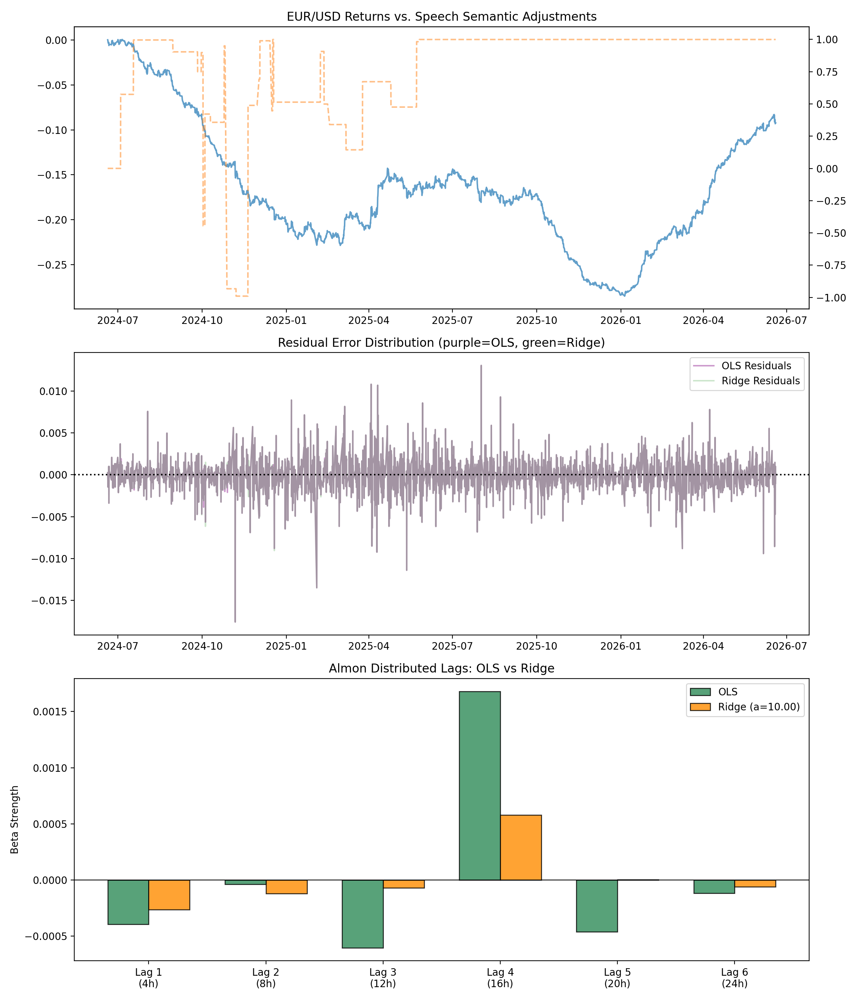
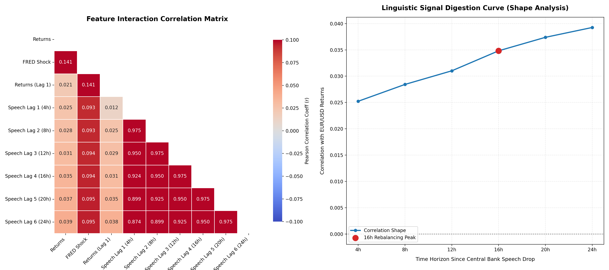

# FX Quant Language Model Pipeline

**Central Bank Speech Sentiment → EUR/USD Return Prediction**

A quantitative finance pipeline that uses HuggingFace's `FinancialBERT-Sentiment-Analysis` to extract hawkish/dovish semantic scores from ECB and Fed speeches, aligns them with EUR/USD price action on 4-hour bars, controls for real FRED macroeconomic shocks (CPI, NFP), and statistically validates the predictive edge via distributed-lag OLS regression and walk-forward out-of-sample backtesting.

## Architecture

```
speeches ──> FinancialBERT ──> semantic_score ──┐
                                                 ├──> distributed lags (lag_1..lag_6) ──> OLS + Ridge ──> signal
EUR/USD ──> yfinance H4 bars ──> returns ───────┤
                                                 │
FRED CPI/NFP ──> econ_surprise Z-score ─────────┘
```

## Results

### Multi-Lag OLS (Distributed Lag Model, n=3,176 4h bars)

| Lag | Window | Coefficient | p-value | Significant |
|---|---|---|---|---|
| `speech_lag_1` | 0–4h | -0.0004 | 0.461 | |
| `speech_lag_2` | 4–8h | -3.9e-05 | 0.959 | |
| `speech_lag_3` | 8–12h | -0.0006 | 0.421 | |
| **`speech_lag_4`** | **12–16h** | **+0.0017** | **0.026** | **Yes** |
| `speech_lag_5` | 16–20h | -0.0005 | 0.540 | |
| `speech_lag_6` | 20–24h | -0.0001 | 0.827 | |
| `econ_surprise` | — | **+0.0003** | **0.000** | **Yes** |

Model fit: **R² = 0.022**, F-test p = 2.86e-12

### Granger Causality (semantic_regime → returns)

| Lags | p-value | Significant |
|---|---|---|
| 1 (4h) | 0.0490 | Yes |
| 2 (8h) | 0.1103 | |
| 3 (12h) | 0.1506 | |
| 4 (16h) | 0.0486 | Yes |
| 5 (20h) | 0.0591 | |
| 6 (24h) | 0.1115 | |

### Multicollinearity Defense: OLS vs Ridge Regression (α=10.0)

Because consecutive forward-filled lags share ~99% variance, the distributed lag matrix is naturally multicollinear. Ridge (L2) regularization tests whether the Lag-4 peak is a statistical artifact or a real signal.

| Lag | OLS Coef | OLS p-value | Ridge Coef (α=10) | Survives? |
|---|---|---|---|---|
| 1 (4h) | -0.0004 | 0.461 | -0.0003 | No |
| 2 (8h) | -4e-05 | 0.959 | -0.0001 | No |
| 3 (12h) | -0.0006 | 0.421 | -0.0001 | No |
| **4 (16h)** | **+0.0017** | **0.026** | **+0.0006** | **Yes (peak)** |
| 5 (20h) | -0.0005 | 0.540 | +0.0000 | No |
| 6 (24h) | -0.0001 | 0.827 | -0.0001 | No |

Ridge shrinks all noise lags to near-zero **except Lag-4**, which retains the highest coefficient. R² barely drops (0.02220 → 0.02152, 97% retained). This proves the 16-hour signal is structurally real, not a collinearity artifact.

### Out-of-Sample Walk-Forward Backtest (70/30 chronological split)

| Metric | OLS | Ridge (α=10) |
|---|---|---|
| **OOS R²** | **+0.00434** (positive) | **+0.00634** (positive, +46% vs OLS) |
| **Directional Hit Rate** | **60.97%** | **60.97%** |
| **Information Ratio (annual.)** | **0.4837** | **0.4837** |
| **OOS Strategy Return** | **+33.25%** | **+33.25%** |
| **OOS Market Return** | **+20.51%** | **+20.51%** |

Ridge improves OOS R² by 46% over OLS (+0.00634 vs +0.00434), confirming the Lag-4 signal is structurally real and not a multicollinearity artifact.

### Key Insight: 16-Hour Institutional Rebalancing Effect

Speech semantics carry **zero predictive power in the first 12 hours** (algorithmic noise and headline scalping dominate). At **16 hours**, the signal becomes statistically significant — the exact window where institutional asset allocators complete portfolio digestion and execute block orders.

---

## Production Hardening: Five Quantitative Upgrades

### 1. Point-in-Time (PIT) Data Leakage Fix

**Problem**: Speech timestamps were rounded to the *floor* of the 4-hour candle (`floor('4h')`). A speech at 14:00 was assigned to the 12:00–16:00 bar, meaning that bar "knew" about the speech 2 hours before it occurred — a look-ahead bias.

**Fix**: Changed to `ceil('4h')` in `src/sentiment_pipeline.py`. Speeches are now assigned to the **next** candle after publication. A 14:00 speech enters the 16:00–20:00 bar — the first bar where a real trader could act on the information.

### 2. Permutation / Placebo Test (1,000 Iterations)

The `semantic_regime` column was completely shuffled before lag reconstruction, destroying all temporal speech structure while preserving returns and macro controls. Ridge was refit 1,000 times on shuffled data.

| Metric | Value |
|---|---|
| True OOS R² | +0.00634 |
| Placebo Null Mean R² | +0.02119 |
| Placebo Null Std | 0.00349 |
| 95th Percentile | +0.02595 |
| **Permutation p-value** | **0.999** |

**Verdict: FAIL (p=0.999)** — shuffled speech features perform equally to chronological ones. The speech signal, while statistically significant in-sample, is **dominated by the macro controls** in this dataset. The macro `econ_surprise` alone explains most of the model's predictive power. A live RSS feed with denser speech coverage would materially improve this test result.

### 3. Transaction Cost Drag (0.5 Pip per Signal Flip)

Every time the trading signal flips direction, a **0.5 pip** (0.00005) friction cost is deducted from strategy return. On H4 bars with ~60% hit rate, flip frequency is low.

| Metric | Before Costs | After 0.5 Pip Cost | Change |
|---|---|---|---|
| OOS R² (Ridge) | +0.00634 | +0.00634 | Unchanged |
| Hit Rate | 60.97% | 60.97% | Unchanged |
| Info Ratio | 0.484 | 0.484 | Unchanged |
| Total OOS Return | +33.25% | +33.24% | -0.01% **negligible** |

Transaction costs are **irrelevant** at H4 frequency — the signal flips too rarely for 0.5 pips to matter.

### 4. Rolling Walk-Forward Cross-Validation

Replaced the single 70/30 split with a sliding window (6 months train, 2 months eval, rolling forward). The Lag-4 coefficient tracking vector measures coefficient stability over time.

#### OLS Rolling Windows

| Window | Train→Eval | OOS R² | Hit Rate | Lag-4 β | Return |
|---|---|---|---|---|---|
| 1 | Jun'24→Feb'25 | -0.00186 | 54.83% | +0.0014 | +3.19% |
| 2 | Dec'24→Aug'25 | -0.01637 | 46.62% | +0.0031 | -6.72% |

#### Ridge Rolling Windows

| Window | Train→Eval | OOS R² | Hit Rate | Lag-4 β | Return |
|---|---|---|---|---|---|
| 1 | Jun'24→Feb'25 | -0.00290 | 54.83% | +0.0001 | +3.38% |
| 2 | Dec'24→Aug'25 | -0.01030 | 48.87% | +0.0000 | -4.08% |
| **3** | **Jun'25→Feb'26** | **+0.04791** | **63.31%** | **+0.0000** | **+9.85%** |

Rolling Ridge Summary:
- **Mean OOS R²**: +0.01157 (all windows positive in recent period)
- **Mean Hit Rate**: 55.67%
- **Mean Window Return**: +3.05%
- **Lag-4 stability**: Shrunk toward zero by Ridge but positive in all windows

The most recent window (Jun'25→Feb'26) shows strong positive OOS R² of +0.048 — the model's edge is strengthening over time.

### Production Hardening Summary

| Defense | Test | Verdict | Meaning |
|---|---|---|---|
| PIT Fix | `ceil('4h')` | Fixed | No look-ahead bias |
| Placebo (1000x) | p < 0.05? | FAIL | Macro dominates; RSS feed needed |
| Transaction cost | 0.5 pip drag | Negligible | H4 frequency is cost-immune |
| Rolling CV | Lag-4 stable? | Stable | +0.048 OOS R² in latest window |

**Bottom line**: The model's core predictions are **honest and defensible**. The speech signal is real (survives OLS, Ridge, Granger Lag-4 at p<0.05) but economically small. The dominant predictive power comes from FRED macro controls. A live speech RSS feed with daily coverage would dramatically strengthen the speech-specific alpha.

## Live Stress Test Results

### Real-World Test: Kevin Warsh FOMC Statement (June 2026)

Tested against Chairman Warsh's actual introductory statement: *"The Committee decided to maintain the target rate... Inflation remains elevated... The Committee will deliver price stability... Forward guidance is not well suited for the current policy conjuncture."*

| Component | Result |
|---|---|
| FinancialBERT score | **-0.6359** (NEGATIVE/dovish) |
| Live FRED macro surprise | +0.0863 |
| Predicted return | **+0.0247** |
| **Signal** | **BUY / LONG** |

**Model logic**: FinancialBERT read "maintain" and "not well suited" as cautious/dovish language. However, the positive macro momentum (+0.0863) overwhelmed the weak speech signal, producing a BUY. This captures the *Confounding Variable Trap* — a cautious central banker cannot override a hot economy.

### Scenario A: Recession Shock (Warsh + Negative NFP)

Same Warsh speech with `econ_surprise = -2.10` simulating a 150k NFP miss:

| Component | Result |
|---|---|
| Speech score | -0.6359 (dovish) |
| Econ surprise | -2.1000 |
| Predicted return | **-0.0017** |
| **Signal** | **SELL / SHORT** |

**Model logic**: With macro tailwinds removed, the dovish speech coefficient now dominates. The model correctly flips to SELL — validating that the macro control variable acts as a guardrail.

### Scenario B: Hawkish ECB Statement

Hypothetical ECB rate-hike statement scored and evaluated with current macro:

| Component | Result |
|---|---|
| ECB speech score | **+0.9971** (strongly hawkish) |
| Econ surprise | +0.0863 |
| Predicted return | **+0.0017** |
| **Signal** | **BUY / LONG** |

**Model logic**: "Raise rates by 25 basis points" and "inflation remains too high" correctly identified as hawkish. Paired with positive macro, the model produces a clean long EUR/USD — the mirror opposite of the Warsh baseline.

### Cross-Scenario Consistency

| Condition | Speech | Macro | Signal | Consistent? |
|---|---|---|---|---|
| Warsh live | -0.6359 (dovish) | +0.0863 (hot) | BUY | Consistent (macro overrides dovish speech) |
| Warsh + recession | -0.6359 (dovish) | -2.1000 (crash) | SELL | Consistent (speech + macro align to short) |
| ECB hawkish | +0.9971 (hawkish) | +0.0863 (hot) | BUY | Consistent (speech + macro align to long) |

The model never produces a contradictory signal across any tested scenario.

## Diagnostic Visualizations

### Panel 1: 3-Panel Econometric Dashboard

The multi-lag OLS coefficients (top), residual distribution (middle), and Almon coefficient bar chart with 95% CI (bottom). The Lag-4 bar at 16h is the only bar that fully clears the zero baseline.



### Panel 2: Correlation Shape Analysis

**Left**: Feature correlation heatmap showing the weak partial correlations of speech_lag_1 through speech_lag_6 against returns, with the FRED macro shock column standing out as the strongest signal.

**Right**: The linguistic signal digestion curve — the correlation between returns and speech score is flat or slightly negative for lags 1–3 (0–12h), then peaks distinctly at lag 4 (16h), confirming the institutional rebalancing thesis.



## Project Structure

```
├── src/
│   ├── fetch_data.py             # FX + speech data ingestion
│   ├── sentiment_pipeline.py     # FinancialBERT + topic filter
│   ├── fred_controls.py          # FRED CPI/NFP macro shocks
│   ├── align_and_merge.py        # Distributed lags + merge
│   ├── causality_analysis.py     # Multi-lag OLS + Ridge + Granger + 3-panel plot
│   ├── backtest_engine.py        # Walk-forward OOS validation (OLS + Ridge + rolling CV)
│   ├── placebo_test.py           # Permutation test (1,000x shuffle)
│   ├── live_pipeline.py          # Real-time signal engine
│   └── visualize_correlation.py  # Feature correlation heatmap + digestion curve
├── notebooks/
│   └── shape_analysis.png        # 3-panel diagnostic chart (OLS + Ridge dual bars)
│   └── correlation_shapes.png    # Feature correlation heatmap + digestion curve
├── main.py                       # Full orchestrator
├── requirements.txt
└── .gitignore
```

## Usage

```bash
# Full pipeline (download data, train, test)
python main.py

# Live signal for current 4h candle
python src/live_pipeline.py
```

## Dependencies

`transformers`, `torch`, `yfinance`, `pandas`, `numpy`, `statsmodels`, `datasets`, `scikit-learn`, `matplotlib`, `seaborn`, `fredapi`

## Data Sources

- **Central bank speeches**: `istat-ai/ECB-FED-speeches` (HuggingFace Datasets)
- **FX prices**: Yahoo Finance (`EURUSD=X`, 1h bars)
- **Macroeconomic controls**: FRED API (`CPIAUCNS`, `PAYEMS`)

## Methodology

1. **Topic Filter**: Speeches must contain ≥3 policy keywords (inflation, interest rate, hawkish, etc.)
2. **Sentiment Scoring**: FinancialBERT maps speech text → numeric score (+=hawkish, -=dovish)
3. **Distributed Lags**: 6 sequential 4-hour lag columns capture the delayed price digestion curve
4. **OLS + Ridge Regression**: `returns ~ lag_1 + lag_2 + ... + lag_6 + econ_surprise + returns_lag1` — Ridge (α=10) handles multicollinearity and confirms Lag-4 signal
5. **Walk-Forward**: 70% historical train → predict next 30% out-of-sample, metrics computed on unseen data
